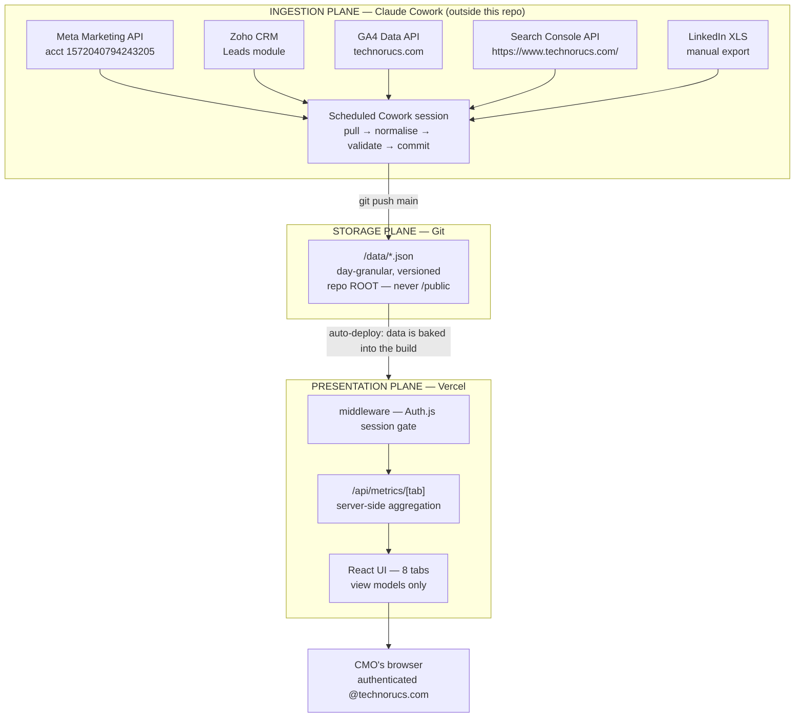
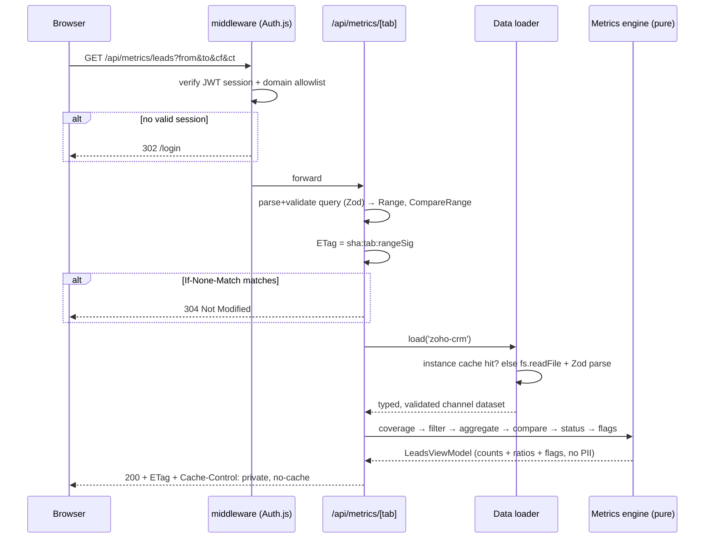

**TechnoRUCS**

**CMO Dashboard — Real-Time Platform**

Technical Architecture Document (TAD)

Version 1.1 | August 10, 2026 (v1.1 addendum same day as v1.0 baseline)

Source documents: `TechnoRUCS_CMO_Dashboard_RealTime_Requirements_v2.1.md` (BRD), `TechnoRUCS_CMO_Dashboard_TRD_v1.0.md` (TRD), `/Wireframe` (25 screens, 8 tabs)

Status: **Read §0 first.** §0 is a same-day architecture pivot, confirmed directly by the CMO, that supersedes ADR-002 and ADR-005 and everything downstream of them (§5, §6, §11 in particular). The rest of the v1.0 body below is kept intact as the historical record §17-style traceability depends on, but wherever it conflicts with §0, **§0 wins.** Two decisions from the original baseline remain open and are isolated in §16.

---

## 0. Addendum — v1.1 architecture pivot: static React SPA, no application backend

**Confirmed with the CMO, 2026-08-10, same session as the v1.0 baseline above — before any code was written against it.**

### 0.1 What changed and why

v1.0 (§2, §4 ADR-002/ADR-005) chose a Next.js app with Node route handlers doing server-side aggregation, specifically so raw Zoho lead notes never reached the browser and so `/data` could sit outside any publicly-servable directory. The CMO has since directed a simpler stack: **Vite + React, fully client-side, no backend of any kind.** That is a real trade against the privacy guarantee ADR-002 was built to provide, not a cosmetic swap — this section says exactly what changes to keep the trade honest instead of silently dropping it.

### 0.2 ADR-011 — Vite + React SPA, fully static, no server · [Confirmed]

*Decision:* Vite + React 19 + TypeScript `strict` + `react-router`. The build output is 100% static assets (HTML/CSS/JS + `/public/data/*.json`) — no Node server process, no API routes, no middleware, no edge functions. Deployable to any static host (Vercel static output, GitHub Pages, Azure Static Web Apps, etc.) with no runtime dependency beyond serving files.

*Supersedes:* ADR-005 in full (no Next.js, no App Router, no Node runtime requirement). Reverses ADR-002's "aggregate server-side by default" — the TRD's original §6.2 client-side-filtering default is restored, permanently this time, not as an escape hatch.

*What does not change:* `src/lib/**` stays pure and framework-agnostic (P6) — the same `Ratio`/`Coverage`/rules/narrative code that would have run on a Node server now runs in the browser instead, unmodified. Every unit test in §13 still applies verbatim; only the caller (a React hook instead of a route handler) differs.

*Rationale given:* simplicity — one deployable artifact, no server code to write, own, or debug; matches "database-free, JSON-backed" spirit of the BRD even more literally than the original design did.

### 0.3 ADR-012 — PII minimisation moves from "server strips it per request" to "it is never written" · [Confirmed]

*Context:* P3 ("raw records never reach the browser") was enforced by ADR-002's server aggregation step. With no server, nothing stands between `public/data/zoho-crm.json` and the browser — whatever is in that file, ships.

*Decision:* **`zoho-crm.json`'s `notes` field is never included in the file the app ships at all.** Not redacted at read time — never written at ingestion time. The Zod schema for the shipped file has no `notes` property and is `.strict()`, so a stray `notes` key fails validation the same mechanical way an accidental `cpc` field fails P1's schemas. If a future feature needs the raw note (e.g. Cowork's own lead-intent classification pass, TAD §16.1 Path B), that pass reads notes from its own private Zoho pull — it never round-trips them through the committed file.

*Consequence — P3 is restated:* ~~"Raw records never reach the browser, enforced by server-side aggregation."~~ → **"No field the browser has no legitimate reason to display is ever written into `public/data/**`, enforced by a `.strict()` schema with the field absent."** Same mechanical-not-cultural spirit as every other invariant in §3; the enforcement point just moved from request-time to ingestion-time.

*Everything else in §7 (schemas, envelope, per-channel shapes) is unchanged except this one field removal and the path change in §0.5.*

### 0.4 ADR-013 — Auth: MSAL.js browser SPA flow against Entra ID, no server session · [Confirmed, with a flagged residual risk]

*Decision:* `@azure/msal-browser` + `@azure/msal-react`, Authorization Code + PKCE flow, entirely in the browser. Restricted to the `technorucs.com` Entra tenant via the ID token's tenant claim, checked client-side by a pure predicate function (unit-testable exactly like the old `signIn` callback was). No server, no session cookie, no JWT minted by this app — Entra's own ID token, held in memory (not `localStorage`), is the credential.

*Rationale:* preserves ADR-001's original reasoning (Microsoft-partner org, real per-user identity, no new credential to issue) without a backend. MSAL.js is the standard, Microsoft-supported pattern for exactly this — SPA-only Entra auth with no server component.

*The trade-off, stated plainly rather than glossed over:* **a static JSON file is fetchable by anyone who has its URL, whether or not they pass the login screen.** There is no server left to check a session before serving `/data/zoho-crm.json` — the login gate protects the *application UI*, not the *asset*. This is strictly weaker than the v1.0 design's guarantee and is the direct, unavoidable cost of "no backend." Two mitigations, neither alone sufficient:

1. **ADR-012** — the worst-case leak is now a stripped-down marketing/CRM aggregate file with no free-text customer content, not raw lead notes.
2. **Host-level access control, as defense in depth, not code** — enable the static host's built-in deployment/password protection (e.g. Vercel Deployment Protection) in front of the *entire* deployment including asset paths, so an anonymous request to any URL is challenged before anything is served. This is hosting configuration, and does not reintroduce an application backend.

*Flagged for the CMO, per TASK.md §8's own convention:* is this residual exposure — a determined party with a direct file URL and no host-level password bypasses the login screen — acceptable for this data, or does it change the "no backend" decision specifically for the auth boundary? Recorded as an open item in §16.4. **Proceed with the design above in the meantime**; it is not a blocker for Phases 0–4, only for the final production security sign-off in Phase 5.

### 0.5 ADR-014 — Data lives in `public/data/`; caching is host config, not a computed ETag · [Confirmed]

*Decision:* `/data` moves from "repo root, server-read only" to **`public/data/`** — the opposite of the old placement rule, and deliberate. The app fetches `public/data/*.json` with plain `fetch()`; TanStack Query wraps the calls for in-session memoisation (`staleTime: Infinity` — same rationale as before, a deployment's data is immutable once built). There is no server to compute `ETag: sha:tab:rangeSig` (ADR-006 is retired); cache-busting instead relies on the static host's own caching for the `/data` path (configured once, e.g. in `vercel.json` headers) plus TanStack Query's in-memory cache for the browser session.

*Consequence:* aggregation runs client-side on every range change, memoised only for the current tab's session (not across a reload). At the data volumes in BRD §15.3 this is expected to comfortably clear the 3-second budget — the budget is now a client-CPU number, not a server-response number, and is instrumented client-side (§12.1 update below).

### 0.6 What is unaffected

Every one of these is framework-agnostic and needs no rework: the six data-source schemas and their per-channel shapes (§7.2, §7.3, minus the `notes` removal above); `Ratio`/`Coverage`/time/rules/narrative (§9, §10) — same code, different host; the wireframe-derived visual system and component inventory (§11.6, §11.7, P8); the ingestion/Cowork contract (§8) — Cowork still writes JSON and pushes to `main`, it just writes to `public/data/` now and omits `notes`; the reconciliation/testing strategy (§13); the twelve rules and their fixtures (§10.1).

### 0.7 Repository layout (supersedes Appendix A)

```
technorucs-cmo-dashboard/                 (private)
├─ public/
│  └─ data/                               ← now deliberately public — see ADR-012/014
│     ├─ meta-ads.json  zoho-crm.json  ga4.json  gsc.json  linkedin.json
│     ├─ narratives.json
│     └─ config/
│        ├─ brand-terms.json  page-types.json
│        ├─ linkedin-competitors.json  thresholds.json
│        └─ sales-reps.json
├─ schemas/                               ← generated from Zod, unchanged in role
├─ scripts/                               ← validate-data.mjs, scan-secrets.mjs, build-schemas.mjs,
│                                            check-sync-timestamps.mjs, linkedin/convert.ts — all
│                                            still Node/CI-time tooling; "no backend" means no
│                                            request-serving server, not "no Node anywhere"
├─ src/
│  ├─ main.tsx                            ← Vite entry
│  ├─ App.tsx                             ← router root: MsalProvider → QueryClientProvider → routes
│  ├─ auth/                               ← msalConfig.ts, AuthGuard.tsx, tenant/allowlist predicate
│  ├─ routes/                             ← one route module per tab, react-router
│  │  ├─ layout.tsx                       ← Sidebar + TopBar shell, mounted once (was (dashboard)/layout.tsx)
│  │  ├─ overview.tsx  adCampaigns.tsx  leads.tsx  website.tsx
│  │  ├─ seo.tsx  email.tsx  linkedin.tsx  totalLeads.tsx
│  │  └─ login.tsx
│  ├─ data/                               ← client fetch+cache layer (was src/server/data/)
│  │  ├─ loader.ts                        ← fetch → Zod parse → in-memory cache, replaces fs.readFile
│  │  └─ schemas.ts
│  ├─ viewmodels/                         ← same composition logic as before, called from hooks now
│  ├─ lib/                                ← PURE, UNCHANGED (P6): time/ metrics/ coverage/ channels/ rules/ narrative/
│  ├─ components/                         ← shell/ data/ states/ narrative/ — unchanged inventory
│  └─ styles/tokens.css
├─ tests/
│  ├─ fixtures/  unit/  contract/
│  └─ reconciliation/{may,june,july}-2026.golden.json
├─ .github/workflows/ci.yml
├─ vite.config.ts
└─ vercel.json                            ← Cache-Control for /data/**, optional deployment password
```

### 0.8 Environment variables (supersedes Appendix B)

No server secrets exist in this design — there is no server. MSAL client config is a **public client identifier, not a credential**, and is fine to compile into the bundle:

| Variable | Where | Purpose |
|---|---|---|
| `VITE_MSAL_CLIENT_ID` | build-time (`.env`, committed-safe) | Entra app registration's public client ID |
| `VITE_MSAL_TENANT_ID` | build-time | restricts login to the `technorucs.com` tenant |
| `VITE_MSAL_REDIRECT_URI` | build-time | post-login redirect target |
| `VITE_ALLOWED_EMAILS` | build-time, optional | optional extra allowlist on top of the tenant check; empty = tenant-only |

Third-party channel credentials (Meta/Zoho/GA4/GSC/LinkedIn) still never appear anywhere in this repository, in any form — that part of P2 is untouched by this pivot; those live only in Claude Cowork, exactly as in v1.0.

### 0.9 Sections of the v1.0 body below that are now historical, not instructional

§2 (diagram — presentation plane is now "static host", not "Vercel + middleware + API"), §4 ADR-002 and ADR-005 (superseded above), §5–§6 (Node runtime, middleware, route handlers — none of this exists now), §11.2–11.5 (API contract, route handlers — replaced by the fetch layer and hooks in §0.7), Appendix A and B (replaced by §0.7/§0.8). Read them only for the *reasoning* that still applies (e.g. why P3/P4/P1 matter at all) — not for the *mechanism* (which changed). `TASK.md` and `CHECKLIST.md` are the literal, up-to-date build instructions; they have been rewritten in full against this addendum and are authoritative over the v1.0 body wherever the two differ.

---

## 1. Purpose & how to read this document

The BRD says *what* the dashboard must do. The TRD says *how* the pieces are specified. This document defines the **architecture**: the boundaries between parts, the contracts across those boundaries, the invariants that must never be violated, and the reasoning behind each structural choice.

It is written so that a developer joining cold can build the system from it, and a reviewer can trace every decision back to a BRD requirement.

| If you want… | Read |
|---|---|
| The 60-second picture | §2, §3 |
| Why it's built this way | §4 (decision records), §5 |
| What to build first | §14 |
| Schemas and contracts | §7, §9, §11.4 |
| What is still undecided | §16 |
| Where this refines the TRD | §17 |

---

## 2. Architecture at a glance

The system is three **planes** that never call each other synchronously at request time. This is the single most important structural property: it is what makes the dashboard fast, credential-free, and auditable.



**The three planes and their contracts**

| Plane | Owns | Contract it publishes | Never does |
|---|---|---|---|
| **Ingestion** — Claude Cowork | All API credentials, all MCP connectors, all normalisation | Validated JSON files matching `/schemas/*.schema.json`, committed to `main` | Talk to the web app; run inside this repo |
| **Storage** — Git `/data` | Day-granular truth, full history, rollback | File layout + envelope + per-channel record shapes (§7) | Store secrets; store pre-aggregated ratios |
| **Presentation** — Vercel app | Auth, filtering, aggregation, rules, rendering | Per-tab typed view models over HTTP (§11.4) | Hold third-party credentials; call Meta/Zoho/GA4/GSC |

**What this buys us (BRD §15.1, §15.2, §3.2):** the web application has no API keys to leak, no database to operate, no runtime dependency on any external service, and a deployment whose data is immutable — which in turn makes aggressive caching trivially safe (§12.1).

---

## 3. Architecture principles

These are binding. Where a later section appears to conflict, these win.

| # | Principle | Consequence in the build |
|---|---|---|
| **P1** | **Day-granular in, derived at read.** No ratio, rate, or total is ever stored. | `Ratio` type makes averaging-an-average structurally impossible (§9.2). BRD §4.2 note. |
| **P2** | **The app holds no third-party credentials.** | Ingestion lives entirely in Cowork. No write path from the app to Git. CI secret scan enforces it (§6.5). BRD §15.2. |
| **P3** | **Raw records never reach the browser.** | Aggregation runs server-side; the wire carries view models, not lead notes (§4 ADR-002). |
| **P4** | **Absence is a first-class value, never zero.** | Every channel query returns a `Coverage` discriminated union; components cannot render a number without handling it (§9.4). BRD §4.1, §14. |
| **P5** | **One clock: Asia/Kolkata (+05:30).** | A single `toBusinessDate()`; raw `new Date(string)` parsing is lint-banned outside `lib/time` (§9.3). BRD §4.2. |
| **P6** | **The computation core is pure and isomorphic.** | `src/lib/**` has zero I/O, zero React, zero `process`. It is the only place metrics are defined, and it is 100% unit-testable. |
| **P7** | **Numbers are computed; only phrasing is authored.** | Hybrid narrative: rules engine computes flags for any range; `narratives.json` supplies wording (§10). BRD §13 option 3. |
| **P8** | **The visual system is frozen.** | This is a data + filtering upgrade, not a redesign. Tokens lifted verbatim from `static-preview.html` (§11.7). BRD §14. |

---

## 4. Architecture decision records

Decisions confirmed with the CMO on 2026-08-10 are marked **[Confirmed]**. Decisions derived from the BRD/TRD by this document are marked **[Derived]** and carry their rationale.

---

**ADR-001 — Per-user SSO, not a shared password** · [Confirmed]

*Context:* BRD §15.2 asks for "at minimum a shared login, ideally per-user accounts."

*Decision:* Auth.js v5 (`next-auth@5`) with **Microsoft Entra ID** as the primary identity provider, restricted to the `technorucs.com` tenant plus an explicit email allowlist. JWT session strategy — no database adapter, consistent with "no backend database" (BRD §3.2). Google Workspace provider is a drop-in alternative if the tenant is not Entra-backed.

*Rationale:* TechnoRUCS is a Microsoft partner running on M365; Entra ID means no new credential for anyone. Per-user identity also makes the audit question ("who looked at lead data") answerable, which a shared password never can.

*Consequence:* Middleware protects **every** route including the data API. There is no anonymous surface except `/login`.

---

**ADR-002 — `/data` lives at repo root and is aggregated server-side** · [Confirmed]

*Context:* TRD §6.2 proposed client-side filtering as the default, with a serverless function as a later escape hatch. `zoho-crm.json` holds per-lead `notes` and `owner` names.

*Decision:* Invert the TRD default. `/data` sits at **repo root, never in `/public`**, so it is never a fetchable static asset. Aggregation runs in a Node route handler; the browser receives typed view models only.

*Rationale (three independent reasons, any one sufficient):*
1. **Privacy.** Repo visibility does not protect served files — anything under `/public` is a public URL regardless. Server-side aggregation means raw lead notes never leave the server at all, which is a stronger guarantee than "the repo is private."
2. **Cardinality.** GSC and GA4 dimension tables at 24-month history are megabytes of rows the UI never displays raw (§7.3). Shipping them to the client is waste, not speed.
3. **Correctness locality.** One implementation of each metric, exercised by one test suite, running in one place.

*Consequence:* One HTTP round trip per (tab × range) instead of zero. Mitigated to imperceptibility by immutable-deployment caching and idle prefetch (§12.1) — the measured budget is well inside BRD §15.3's 3-second ceiling.

*Escape hatch preserved:* because `src/lib/**` is isomorphic and pure (P6), moving any channel's filtering back to the client is a call-site change in the data layer, not a rewrite.

---

**ADR-003 — LinkedIn XLS conversion stays in Cowork; the app remains strictly read-only** · [Confirmed]

*Context:* TRD §5.4 says "triggered by upload" without saying where the upload happens.

*Decision:* The CMO hands the XLS to the Cowork session (or drops it in a watched folder); Cowork parses the three sheets, writes `linkedin.json`, appends the coverage window to `meta.uploads[]`, commits, pushes. **No `/upload` route, no GitHub token, no write path in the web app.**

*Rationale:* An in-app upload page would put a repo-scoped write token inside the application, directly contradicting BRD §15.2 and P2. The BRD §16 criterion ("the CMO can complete a LinkedIn XLS upload without developer assistance") is satisfied by a one-page runbook against a workflow the CMO already performs monthly.

*Consequence:* The conversion logic is built as a **pure, I/O-free module** (`scripts/linkedin/convert.ts`) with a thin CLI wrapper. If an upload UI is ever approved, it wraps the same module — no rework, and the decision to accept the credential trade-off is made explicitly at that time.

---

**ADR-004 — Hybrid narratives: computed flags + authored phrasing, keyed by flag** · [Confirmed, with a refinement]

*Context:* BRD §13 option 3. TRD §4.8 sketched `narratives.json` keyed by a *range signature* (`"2026-06-01_2026-06-30_vs_2026-05-01_2026-05-31"`).

*Decision:* Adopt option 3, but key `narratives.json` by **flag ID**, not range signature, with `{placeholder}` slots filled from values computed at read time.

*Rationale:* Range-signature keying silently defeats the product's headline feature. The CMO picks an arbitrary range (BRD §4.1); Cowork cannot have pre-computed a signature for it; the narrative block renders empty on exactly the novel ranges the tool exists to explore. Flag-keyed phrasing works for **every** range, because the flag ("ad set cost/conv exceeds account average by >4×") is computed live and only its wording is authored.

*Consequence:* Every flag ships with a built-in default template, so a flag Cowork has never phrased still renders a correct, plain sentence rather than nothing. Detail in §10.

---

**ADR-005 — Next.js 15 App Router, TypeScript strict, Node runtime** · [Derived]

*Decision:* Next.js 15 (App Router) / React 19 / TypeScript `strict`. Route handlers on the **Node.js** runtime, not Edge.

*Rationale:* TRD §3 already proposes Next.js on the existing Vercel project. Node runtime is required because handlers read `/data` from the filesystem — Edge has no `fs`. Cold-start cost is irrelevant at this user count; correctness and simplicity are not.

*Key configuration:* `/data` is not automatically traced into the serverless bundle because nothing statically imports it. It must be declared:

```ts
// next.config.ts
export default {
  outputFileTracingIncludes: {
    '/api/metrics/[tab]': ['./data/**/*.json'],
    '/api/health/data':   ['./data/**/*.json'],
  },
}
```

*Rejected alternative:* `import data from '../../data/gsc.json'`. Static imports bundle every byte into the JS chunk of every function that touches the module graph, inflating cold starts and defeating per-channel lazy reads.

---

**ADR-006 — Deployment immutability as the caching primitive** · [Derived]

*Decision:* Treat `VERCEL_GIT_COMMIT_SHA` as the data version. Aggregated responses carry `ETag: "<sha>:<tab>:<rangeSignature>"`.

*Rationale:* Data changes only when Cowork pushes, and a push produces a new deployment. Within one deployment the data is provably immutable, so cached aggregates can never go stale. This converts a repeated range selection into a 304 with no computation.

---

**ADR-007 — Metric registry with explicit polarity** · [Derived]

*Context:* BRD Appendix A defines status by whether a metric "moved unfavourably." Neither the BRD nor the TRD says which direction is favourable per metric — and it inverts: sessions up is good, cost-per-conversation up is bad, bounce rate up is bad.

*Decision:* A single `MetricRegistry` declares, for every metric in the product: `id`, `label`, `unit`, `polarity` (`higher-better` | `lower-better` | `neutral`), formatter, and owning channel. Status, colour, arrow direction, and number formatting all derive from it.

*Rationale:* Without this, polarity gets re-decided ad hoc at ~40 call sites and will be wrong in at least one. This is the difference between a dashboard that is trusted and one that is spot-checked.

---

**ADR-008 — Dimension-sliced channel files, not cross-product rows** · [Derived — refines TRD §4.5, §4.6]

*Context:* TRD §4.6 specifies `gsc.json` as "one row per query/page/country/device combination per day." TRD §4.5's `ga4.json` example likewise carries `channelGroup`, `country`, and `device` on the same row as `sessions`.

*Decision:* Both files are restructured into **independent, date-stamped dimension slices** (`daily[]`, `queries[]`, `pages[]`, `countries[]`, `devices[]`), exactly as TRD §4.5 already does for `pages[]`/`sources[]`/`countries[]`.

*Rationale:* Two problems with the cross-product shape. **Size:** the full cross-product is combinatorial and mostly zero-click noise — at 24 months it is the difference between a file measured in MB and one in hundreds of MB. **Correctness:** neither API returns a true cross-product, so summing such rows double-counts. Sessions summed across a `country × device × channel` row set is not total sessions.

*Consequence:* Every rendered table maps to exactly one slice it can sum safely, and `daily[]` is the single authoritative source for headline totals. Detail and per-slice keys in §7.3.

---

**ADR-009 — Meta Ads normalised into dimensions + facts** · [Derived — refines TRD §4.3]

*Decision:* `meta-ads.json` separates slowly-changing ad-set attributes (`adSetName`, `campaignId`, `launchDate`, `region`) into `dimensions.adSets[]`, keyed by `adSetId`, leaving `facts[]` as narrow numeric daily rows.

*Rationale:* TRD §4.3's shape repeats five string fields on every ad-set-day. Over 24 months that is both bulk and a consistency hazard — a renamed ad set produces rows that disagree about their own name, and the breakdown table (BRD §6.2) then shows one ad set twice.

---

**ADR-010 — "Last synced" verified by CI, not by reading git history at build time** · [Derived]

*Context:* BRD §16 requires each source's displayed timestamp to match the most recent commit touching its JSON file.

*Decision:* The UI displays `meta.lastSyncedAt` from the file. A CI check on every PR touching `/data` (checked out with full history) asserts that each changed file's `lastSyncedAt` is within a tolerance of that commit's timestamp, failing the PR otherwise.

*Rationale:* Deriving the timestamp with `git log` at build time is unreliable — Vercel builds from a shallow clone, and the last commit touching a rarely-updated file can fall outside it, yielding a blank or wrong badge. Asserting the invariant in CI, where full history is available, satisfies the acceptance criterion without a runtime dependency on git.

---

## 5. System topology & runtime

### 5.1 Deployment unit

One Vercel project, one Git repository (`technorucs-jp/technorucs-cmo-dashboard`, **private**), one deployment per push to `main`. A deployment bundles: the compiled app, the `/data` JSON as traced assets, and the commit SHA as the data version. There is no external runtime dependency — no database, no cache server, no third-party API.

### 5.2 Request lifecycle



`Cache-Control: private, no-cache` with a strong `ETag` is deliberate: it forces a revalidation request the middleware can gate, while making the payload itself free on repeat. `max-age` would let a response outlive a session revocation.

### 5.3 Environments

| Environment | Trigger | Auth | Data |
|---|---|---|---|
| Production | push to `main` | Entra ID, live allowlist | `/data` as committed |
| Preview | PR | Entra ID, same allowlist | the PR's `/data` — lets a data change be reviewed visually before merge |
| Local | `npm run dev` | dev credentials provider (bypass, non-production only) | fixtures or a repo checkout |

Preview deployments earn their place here: a Cowork run that produces subtly wrong data is caught by looking at a PR, not by the CMO noticing a wrong number in production.

---

## 6. Security architecture

### 6.1 Authentication

Auth.js v5, `MicrosoftEntraID` provider, JWT sessions (no database — ADR-001). Session cookie: `httpOnly`, `secure`, `sameSite=lax`, 8-hour lifetime with rolling refresh.

### 6.2 Authorization

Two gates, both server-side:

1. **Tenant gate** — the `signIn` callback rejects any account whose verified email domain is not `technorucs.com`.
2. **Allowlist gate** — `AUTH_ALLOWED_EMAILS` (comma-separated) must contain the address. Empty allowlist means domain-only.

A single role, `viewer`. There is no write surface in the application, so there is nothing to authorize beyond read access. The role field exists in the JWT so a future `admin` (e.g. threshold editing) does not require re-plumbing.

### 6.3 Data-plane protection

```
middleware.ts matcher: ['/((?!login|api/auth|_next/static|_next/image|favicon.ico).*)']
```

Everything except the login page and the auth callback requires a session — pages **and** `/api/metrics/*` **and** `/api/health/*`. Combined with ADR-002 (`/data` is not a static asset), there is no URL on the deployment that returns marketing data to an anonymous caller.

### 6.4 Data minimisation at the boundary

Server-side aggregation is what makes this enforceable rather than aspirational. Concretely, for the Leads tab:

| Stays on the server | Crosses to the browser |
|---|---|
| `notes` (customer free text) | bucket label + count per bucket |
| `leadId` | — |
| `owner` (rep full name) | rep display name + counts (a table the CMO must be able to read) |

Rep names cross deliberately — BRD §7.3's "88% of leads on one rep" finding is unreadable without them, and the audience is the internal team.

### 6.5 Secrets

| Secret | Lives in | Never in |
|---|---|---|
| Meta / Zoho / GA4 / GSC connector credentials | Claude Cowork environment only | this repo, in any form |
| `AUTH_SECRET`, `AUTH_MICROSOFT_ENTRA_ID_*` | Vercel environment variables | the client bundle, `NEXT_PUBLIC_*`, `/data` |

`npm run scan:secrets` runs in CI on every PR, scanning `/data` and all application source for credential patterns (bearer tokens, `AKIA`, PEM headers, `client_secret`, long base64 blobs). This is the executable form of the BRD §16 criterion — it converts a promise into a build failure.

---

## 7. Data architecture

### 7.1 Layout

```
/data                          ← repo root. NOT /public. Server-read only.
  meta-ads.json
  zoho-crm.json
  ga4.json
  gsc.json
  linkedin.json
  narratives.json              ← flag-keyed phrasing (ADR-004)
  config/
    brand-terms.json           ← BRD §9.1 brand vs non-brand
    page-types.json            ← BRD §8.3 Landing/Blog/Service/Conversion/Trust
    linkedin-competitors.json  ← BRD §11.2
    thresholds.json            ← BRD Appendix A, tunable without a code change
/schemas
  meta-ads.schema.json  zoho-crm.schema.json  ga4.schema.json
  gsc.schema.json       linkedin.schema.json  narratives.schema.json
```

Config files are separate from data on purpose: editing the brand-term list must not require a re-sync, and re-syncing must not overwrite a CMO's tuning. Both are Git edits — reviewable, revertible, no deploy step beyond the push.

### 7.2 Common envelope

Every channel file:

```jsonc
{
  "schemaVersion": 1,
  "meta": {
    "channel": "meta-ads",
    "lastSyncedAt": "2026-08-10T09:03:11+05:30",
    "earliestRecordDate": "2026-05-01",
    "latestRecordDate": "2026-08-09",
    "syncSource": "Meta Marketing API",
    "coworkRunId": "run_2026-08-10T0900",
    "rowCounts": { "facts": 1284 }
  }
  // + channel-specific arrays
}
```

`schemaVersion` is added to the TRD envelope so a future shape change is a version bump the loader can branch on, rather than a silent break. `earliestRecordDate` / `latestRecordDate` let the coverage check (§9.4) answer "do we have data for this range" in O(1), without scanning records.

**`latestRecordDate` ≠ `lastSyncedAt`.** For GSC these differ by 2–3 days by design (BRD §9 note). The "data as of" banner reads `latestRecordDate`; the "last synced" badge reads `lastSyncedAt`. Conflating them under-reports Google's lag as a sync failure.

### 7.3 Per-channel record shapes

**`meta-ads.json`** (ADR-009 — dimensions + facts)

```jsonc
{
  "meta": { "channel": "meta-ads", "...": "..." },
  "dimensions": {
    "adSets": [{
      "adSetId": "1203...", "adSetName": "Construction Co. Australia",
      "campaignId": "1201...", "campaignName": "Construction AU",
      "launchDate": "2026-06-11", "region": "AU"
    }]
  },
  "facts": [{
    "date": "2026-06-11", "adSetId": "1203...", "country": "AU",
    "spend": 9255.62, "impressions": 5368, "reach": 2970,
    "clicks": 105, "conversations": 22
  }],
  "account": [{
    "date": "2026-06-11", "opportunityScore": 100, "recommendations": []
  }]
}
```

Natural key: `date + adSetId + country`. **`cpc`, `cpm`, `ctr`, `frequency`, and cost/conversation are absent by design** — every one is a ratio, and P1 forbids storing ratios. TRD §4.3 listed them on the record; they are removed here because a stored `cpc` is correct for exactly one date range and silently wrong for every other. `reach` is stored but flagged non-additive (§9.2).

**`zoho-crm.json`** — one row per lead, exactly as TRD §4.4. `Partner`, `Referral`, and `ZoomInfo` are excluded by Cowork **before write** (BRD §7, TRD §4.4), so the exclusion is auditable at the ingestion layer rather than re-implemented per query.

```jsonc
{ "leadId": "4876...", "createdTime": "2026-06-03T11:42:00+05:30",
  "leadSource": "Meta Ads", "leadStatus": "Attempted to Contact",
  "owner": "Gopinath", "inquiryType": null,
  "notes": "How does the software work for multiple sites?" }
```

`inquiryType` stays nullable pending §16.1. `notes` remains in the file (repo is private) and never crosses to the browser (§6.4).

**`ga4.json`** (ADR-008)

```jsonc
{
  "meta": { "...": "..." },
  "daily":    [{ "date": "2026-06-15", "totalUsers": 214, "sessions": 267,
                 "screenPageViews": 401, "engagedSessions": 174,
                 "bouncedSessions": 93, "totalSessionDurationSec": 28569 }],
  "channels": [{ "date": "2026-06-15", "channelGroup": "Organic Search",
                 "sessions": 142, "engagedSessions": 98, "bouncedSessions": 44 }],
  "sources":  [{ "date": "2026-06-15", "source": "chatgpt.com",
                 "channelGroup": "AI Assistant", "sessions": 1,
                 "engagedSessions": 1, "bouncedSessions": 0 }],
  "pages":    [{ "date": "2026-06-15", "pagePath": "/solutions/power-bi-consulting/",
                 "screenPageViews": 37, "totalUsers": 13,
                 "engagedSessions": 17, "bouncedSessions": 4,
                 "totalSessionDurationSec": 15466 }],
  "countries":[{ "date": "2026-06-15", "country": "IN", "totalUsers": 629,
                 "bouncedSessions": 88, "totalSessionDurationSec": 44560 }],
  "devices":  [{ "date": "2026-06-15", "device": "desktop", "sessions": 1349,
                 "engagedSessions": 892 }],
  "paths":    [{ "date": "2026-06-15", "step1": "/", "step2": "/contact-us/",
                 "sessions": 123 }]
}
```

Note `bouncedSessions` and `totalSessionDurationSec` are stored as **counts**, not the `bounceRate` / `averageSessionDuration` rates GA4 returns. This is P1 in practice: a range's bounce rate is `Σ bounced ÷ Σ sessions`, which is unrecoverable from a set of daily percentages. Cowork multiplies GA4's rate by the day's sessions at ingestion. Page-type tagging is a render-time lookup into `config/page-types.json` (TRD §4.5).

**`gsc.json`** (ADR-008)

```jsonc
{
  "meta": { "...": "...", "latestRecordDate": "2026-08-07" },
  "daily":     [{ "date": "2026-06-20", "clicks": 18, "impressions": 2140,
                  "sumPosition": 64213, "rows": 2131 }],
  "queries":   [{ "date": "2026-06-20", "query": "dynamics 365 finance and operations",
                  "clicks": 0, "impressions": 562, "sumPosition": 15852 }],
  "pages":     [{ "date": "2026-06-20", "page": "/blog/d365-fo/",
                  "clicks": 3, "impressions": 890, "sumPosition": 21360 }],
  "countries": [{ "date": "2026-06-20", "country": "IN", "clicks": 15,
                  "impressions": 1200, "sumPosition": 30120 }],
  "devices":   [{ "date": "2026-06-20", "device": "MOBILE", "clicks": 7,
                  "impressions": 640, "sumPosition": 14080 }]
}
```

`position` is stored as `sumPosition` (position × impressions) so that average position over a range is `Σ sumPosition ÷ Σ impressions` — an impression-weighted average, which is what GSC itself reports. Averaging daily average positions would over-weight low-impression days and produce a number that disagrees with Search Console. Brand/non-brand is a render-time lookup into `config/brand-terms.json`, so editing the brand list never requires a re-sync (TRD §4.6).

Each slice is capped at top-N per day by clicks-then-impressions (default `N=250` for `queries`/`pages`) with a `truncated: true` marker on the daily row when the cap bites — bounded file growth, with honesty about it in the UI.

**`linkedin.json`** — as TRD §4.7, with `meta.uploads[]` as the coverage source of truth. `dailyTrend[]` stores counts only (`reactions`, `clicks`, `impressions`); `engagementRate` is derived, not stored (P1).

### 7.4 Schema governance

`/schemas/*.schema.json` (JSON Schema draft 2020-12) is the contract between Cowork and the app. It is enforced three times, deliberately:

1. **In Cowork**, before commit — a bad pull never reaches Git (TRD §5.3).
2. **In CI**, on any PR touching `/data` — a hand-edit or a Cowork bug never reaches `main`.
3. **In the loader**, at read time via Zod parse — a schema drift surfaces as a typed error on one channel, not as a mis-rendered number across the dashboard.

The Zod schemas in `src/server/data/schemas.ts` are the TypeScript source of truth; the JSON Schema files are generated from them (`npm run schemas:build`) so the two cannot diverge.

---

## 8. Ingestion architecture (Claude Cowork)

Out of this repository's runtime, but its contract is this repository's concern. The runbook (BRD §15.4) is the CMO-facing face of this section.

### 8.1 Schedule (TRD §5.1)

| Channel | Cadence | Lookback window | Why |
|---|---|---|---|
| Meta Ads | every 1–6 h | 3 days | Attribution windows restate recent days |
| Zoho CRM | every 1–6 h | 7 days | Lead **status** mutates after creation — a lead created Jun 3 becomes "Contacted" on Jun 9 |
| GA4 | daily | 3 days | GA4 processing settles within ~48 h |
| GSC | daily | 5 days | Google's own 2–3 day lag, plus restatement |
| LinkedIn | on upload | n/a | No API (BRD §11) |

The Zoho lookback is the subtle one. An incremental pull keyed on `Created_Time` alone would permanently freeze each lead's status at whatever it was during the sync that first saw it, quietly breaking the contact-rate metrics on BRD §7.1 and the rep table on §7.3. The window must re-fetch by `Modified_Time` as well.

### 8.2 Per-run algorithm

```
for each channel:
  1. read existing file → meta.latestRecordDate
  2. since = latestRecordDate − lookbackWindow
  3. pull via MCP connector [since .. today], IST boundaries for Zoho
  4. normalise to the channel's record shape (§7.3)
       – ratios decomposed into numerator/denominator counts
       – excluded lead sources dropped
  5. upsert into arrays by natural key (overwrite, never append-duplicate)
  6. recompute meta.earliestRecordDate / latestRecordDate / rowCounts
  7. set meta.lastSyncedAt = run completion time (IST)
  8. VALIDATE against /schemas/<channel>.schema.json
       – fail → skip this channel, keep previous good file, record the failure
  9. (optional) regenerate narratives.json phrasing for new flags
 10. git add <written files>
 11. git commit -m "data: sync <channels> (<coworkRunId>)"
 12. git push origin main
```

### 8.3 Validation gates before commit (TRD §5.3)

A write is rejected if any holds:

- `meta` block missing or malformed
- `records`/slices empty where the previous run had data
- `latestRecordDate` moves **backward**
- row count drops by more than 50% versus the previous run
- any secret pattern matches (§6.5)

On rejection the channel is skipped and the previous good file stands. `lastSyncedAt` then goes stale, which the `LastSyncedBadge` surfaces (§11.6) — the failure is visible in the product rather than buried in a job log. Other channels still commit; one broken connector must not block the rest.

### 8.4 LinkedIn conversion (ADR-003)

`scripts/linkedin/convert.ts` exposes:

```ts
convertLinkedInExport(sheets: {
  followers: Sheet; visitors: Sheet; content: Sheet
}): { data: LinkedInFile; coverage: { from: string; to: string }; warnings: string[] }
```

Pure — no filesystem, no network, no globals. Callable from Cowork today, wrappable in a route tomorrow, and unit-testable against committed fixture sheets. The CLI wrapper (`npm run convert:linkedin -- <paths>`) handles file I/O and the `meta.uploads[]` append.

Coverage is derived from the actual min/max dates present in the sheets, not from the filename or the operator's claim — `meta.uploads[]` is what the LinkedIn tab's full-coverage rule (BRD §4.2) depends on, so it must reflect the data, not an assertion about it.

---

## 9. The computation core

`src/lib/**` — pure, isomorphic, no I/O, no React, no `process`. Every number the CMO sees is produced here. This is the highest-value code in the system and the most heavily tested (§13).

### 9.1 Module map

```
src/lib/
  time/          businessDate.ts, range.ts, presets.ts
  metrics/       ratio.ts, aggregate.ts, compare.ts, status.ts, registry.ts
  coverage/      coverage.ts
  channels/      metaAds.ts, zoho.ts, ga4.ts, gsc.ts, linkedin.ts
  rules/         engine.ts, flags/*.ts
  narrative/     render.ts, templates.ts
```

### 9.2 The `Ratio` type — P1 made structural

```ts
/** A ratio that can only exist as summed parts. */
export interface Ratio { readonly n: number; readonly d: number }

export const ratio = (n: number, d: number): Ratio => ({ n, d });
export const sumRatios = (rs: readonly Ratio[]): Ratio =>
  rs.reduce((a, b) => ({ n: a.n + b.n, d: a.d + b.d }), { n: 0, d: 0 });

/** null when undefined — never 0, never NaN. Callers must handle it. */
export const resolve = (r: Ratio): number | null => (r.d === 0 ? null : r.n / r.d);
```

Every rate in the product is a `Ratio` until the moment it is formatted: CTR `ratio(clicks, impressions)`, cost/conversation `ratio(spend, conversations)`, engagement rate `ratio(engagedSessions, sessions)`, contact rate `ratio(contacted, total)`, avg. position `ratio(sumPosition, impressions)`.

Because `Ratio` has no `+` and `resolve` is the only exit, **you cannot average an average by accident** — the type system rejects it. This closes the exact failure mode the BRD calls out in its §4.2 note and the TRD repeats in §4.5 and §6.1, and it closes it once rather than at every call site.

`resolve` returning `null` rather than `0` is the same discipline: an ad set with spend and zero conversations has an *undefined* cost per conversation, and the wireframe already renders that as `—` (Ad Campaigns, "BC Australia — Video"). A `0` there would read as "free leads."

**Non-additive metrics.** `reach` (Meta) and `totalUsers` (GA4) are de-duplicated by the source platform and cannot be summed across days without over-counting. The registry marks them `additive: false`; the aggregator refuses to sum them for multi-day ranges and the UI labels them "n/a for multi-day ranges" or shows the platform-reported figure for the closest matching period. Silently summing them is a wrong number that looks perfectly plausible — which is worse than an honest gap.

### 9.3 Time (P5)

All bucketing is `Asia/Kolkata`. One entry point:

```ts
toBusinessDate(input: string | Date): BusinessDate  // 'YYYY-MM-DD' in IST
```

Zoho's `createdTime` carries `+05:30`; GA4/GSC/Meta dates are already calendar dates in the property's timezone. An ESLint rule bans `new Date(` and `Date.parse(` outside `src/lib/time` — timezone bugs in a reporting product are near-undetectable by eye and permanently corrosive to trust, so the guard is mechanical rather than cultural.

Range presets (BRD §4.1: Today, Last 7 days, Last 30 days, This Month, Last Month, This Quarter, Custom) are computed against IST "today", not the browser's clock.

### 9.4 Coverage — P4 made structural

Every channel query returns coverage alongside data:

```ts
type Coverage =
  | { kind: 'full' }
  | { kind: 'partial'; available: DateRange; missingBefore?: BusinessDate;
      missingAfter?: BusinessDate }
  | { kind: 'none'; earliest: BusinessDate | null; latest: BusinessDate | null }
  | { kind: 'lagging'; dataAsOf: BusinessDate }     // GSC (BRD §9)
  | { kind: 'requires-full-coverage'; gaps: DateRange[] }  // LinkedIn (BRD §4.2)
  | { kind: 'not-connected' };                      // Email (BRD §10)

interface ChannelResult<T> { coverage: Coverage; data: T | null }
```

`data` is `null` for every non-renderable coverage kind, so a component physically cannot render a metric without having handled absence. This is what turns BRD §14's empty-state requirement from a checklist item somebody forgets on the ninth table into a compile-time obligation.

LinkedIn is the deliberate exception (BRD §4.2): partial overlap is a **warning state**, not a silent clip, because a partially-covered follower count is indistinguishable from a bad month.

### 9.5 Comparison and status

```ts
interface Delta {
  current: number | null;
  comparison: number | null;
  pct: number | null;
  direction: 'up' | 'down' | 'flat' | 'undefined';   // flat = |pct| ≤ 2%  (BRD §5.2)
  favourable: boolean | null;                        // direction × registry polarity
}

statusOf(metricId, delta, thresholds) → 'leading' | 'good' | 'monitor' | 'action-needed'
```

Thresholds come from `config/thresholds.json` (BRD Appendix A: +15% / ±5% / 5–30% / >30%, plus metric floors such as GA4 engagement ≥ 60%), so the CMO can tune them in a Git edit without a code change. `favourable` derives from ADR-007's polarity — cost/conversation rising 116% is `direction: 'up'`, `favourable: false`, `status: 'action-needed'`, which is what the June wireframe shows.

When `comparison` is 0 and `current` is not, `pct` is `null` and the UI renders "new" rather than `∞%` or a misleading `+100%`.

### 9.6 Default comparison range

BRD §4.1 makes comparison opt-in, but the Total Leads tab (§12) and the Overview channel-health table (§5.2) are *defined* by comparison. Resolution: when comparison is off, those two surfaces fall back to **immediately-preceding period of equal length** and label it explicitly ("vs. previous 30 days"). No surface silently invents a comparison without saying what it compared against.

---

## 10. Rules & narrative engine (ADR-004)

The wireframe ends every tab with "What's working / what's not" plus Immediate / Process / Strategic actions. The hybrid split: **the rules engine computes, `narratives.json` phrases.**

### 10.1 Flags

```ts
interface Flag {
  id: string;                      // 'meta.adset.cost-per-conv-outlier'
  channel: ChannelId;
  severity: 'positive' | 'watch' | 'critical';
  tier: 'immediate' | 'process' | 'strategic' | 'observation';
  subject: string;                 // 'Business Central — Australia (17 Jun)'
  values: Record<string, number | string | null>;  // { costPerConv: 1923.21, multiple: 4.6 }
  ruleVersion: number;
}
```

Rule modules are pure functions `(viewModel, thresholds) → Flag[]`. Initial set, drawn directly from the wireframe's existing commentary:

| Rule | Fires when | BRD ref |
|---|---|---|
| `meta.adset.cost-per-conv-outlier` | ad-set cost/conv > N× account average | §6.5 |
| `meta.adset.spend-no-conversions` | spend > floor and conversations = 0 | §6.5 |
| `meta.adset.audience-overlap` | ≥3 ad sets, same region+product, overlapping flight dates | §6.5 |
| `zoho.status.stuck-in-attempted` | "Attempted" share > threshold | §7.1 |
| `zoho.owner.concentration` | one owner holds > 70% of assigned leads | §7.3 |
| `zoho.meetings.zero` | meetings scheduled = 0 with leads > floor | §7.1 |
| `ga4.paid.no-attribution` | Meta spend > 0 and GA4 Paid Social sessions = 0 | §8.3 note |
| `ga4.country.suspected-bot` | country bounce > 60% and avg. duration < 10 s | §8.3 |
| `gsc.brand-dominance` | brand click share > threshold | §9.1 |
| `gsc.zero-click-opportunity` | impressions > 100 and position > 50, clicks = 0 | §9.2 |
| `linkedin.coverage.competitor-lead` | reactions/post vs. configured competitor | §11.2 |
| `channel.status.degraded` | any channel-health row hits `action-needed` | §5.2 |

Flags carry their own numbers. This is what lets the narrative be correct for a range no one anticipated.

### 10.2 Phrasing

```jsonc
// data/narratives.json
{
  "schemaVersion": 1,
  "phrasings": {
    "meta.adset.cost-per-conv-outlier": {
      "headline": "{subject} at ₹{costPerConv} per conversation",
      "body": "Spent ₹{spend} for {conversations} messaging {conversations|plural:reply,replies} — {multiple}× the account average. Launched alongside another {region} ad set targeting the same audience, causing auction self-competition. Pause or merge into the stronger ad set.",
      "tier": "immediate",
      "authoredBy": "cowork",
      "authoredAt": "2026-08-10T09:05:00+05:30"
    }
  }
}
```

Rendering is `Flag` + phrasing → text, with `{placeholder}` slots filled from `flag.values` and formatted through the metric registry (₹, %, thousands separators). **Every rule ships a built-in default template in `lib/narrative/templates.ts`**, so an unphrased flag renders a plain correct sentence instead of nothing. `narratives.json` is an enhancement layer, never a dependency.

This is the property that made the flag-keyed design necessary (ADR-004): pick 14 June – 2 August and the numbers are computed live, the wording is reused, and the block renders. Under range-signature keying it would render empty.

Cowork's narrative pass (step 9 in §8.2) writes phrasings for flag IDs it has not yet phrased. It never writes numbers.

---

## 11. Application architecture

### 11.1 Layering

```
app/            routing, layouts, route handlers        — thin
server/         loader, view-model composition          — I/O + orchestration
lib/            metrics, rules, narrative, time         — PURE (P6)
components/     presentation                            — no metric maths
```

The rule that keeps this honest: **`components/` never computes a metric.** A component that needs cost-per-conversation receives it formatted. If a component imports from `lib/metrics`, the layering has been breached — enforced by an import-boundary lint rule.

### 11.2 Routes (BRD §14, TRD §7.1)

| Route | Tab | Source | Comparison |
|---|---|---|---|
| `/overview` | Overview | all channels | required (default: previous period) |
| `/ad-campaigns` | Ad Campaigns | `meta-ads` | optional |
| `/leads` | Leads | `zoho-crm` | optional |
| `/website` | Website | `ga4` | optional |
| `/seo` | SEO | `gsc` | optional |
| `/email` | Email | none | n/a — static not-connected state |
| `/linkedin` | LinkedIn | `linkedin` | optional |
| `/total-leads` | Total Leads | `meta-ads` | **required** |

`/` redirects to `/overview`. All eight live under one `(dashboard)` layout so the sidebar and top bar mount once and picker state survives navigation (TRD §7.2).

### 11.3 URL as state (BRD §4.1, TRD §7.3)

```
/leads?from=2026-06-01&to=2026-06-30&cf=2026-05-01&ct=2026-05-31&preset=last-month
```

The URL is the single source of truth. On mount it is parsed and validated (Zod); a picker change pushes a new URL via client-side navigation; the data layer keys its cache on the resulting range signature. No duplicate range state in React — bookmarking and sharing (BRD §4.1) work because there is nothing else to synchronise.

Invalid or absent params fall back to BRD §4.1's default (current calendar month to date) rather than erroring.

### 11.4 API contract

```
GET /api/metrics/[tab]?from&to&cf&ct   → 200 TabViewModel | 304 | 400 | 401
GET /api/health/data                   → 200 per-channel freshness (runbook, §15)
```

Each tab has one typed view model. Sketch for Leads:

```ts
interface LeadsViewModel {
  range: DateRange; comparison: DateRange | null;
  coverage: Coverage;
  cards: KpiCardVM[];          // ALL statuses, including zero-count (BRD §7.1 v2.1 note)
  sources:  { source: string; count: number; share: number }[];
  statuses: { status: string; count: number; share: number }[];
  dailyVolume: { date: string; bySource: Record<string, number> }[];
  reps: { rep: string; assigned: number; contacted: number; attempted: number;
          lost: number; meeting: number; contactRate: number | null }[];
  intentBuckets: { bucket: string; count: number;
                   statuses: Record<string, number> }[] | null;  // §16.1
  narrative: NarrativeVM;
}
```

Two contract rules the wireframe cross-check made necessary:

- **`cards` always contains every status**, including zero-count "Contact in Future" and "Junk". BRD v2.1's §7.1 note exists precisely because the current static build drops them. Making the view model complete means the UI cannot re-introduce the bug.
- **`reps` always contains every active rep**, including zero-assignment reps (BRD §7.3) — the "Rathish / Mohan / Ram received zero leads" finding *is* the insight, and it disappears if the row is omitted.

The active roster comes from `config/`, not from the filtered data, since a rep with zero leads appears nowhere in a filtered lead set.

### 11.5 Client data layer & prefetch

TanStack Query, keyed `['metrics', tab, rangeSig, compareSig]`, `staleTime: Infinity` (data is immutable per deployment — ADR-006). On idle after first paint, the other seven tabs prefetch for the current range, so tab switches are cache hits and BRD §4.1's "pre-warms the other tabs" is satisfied. A range change invalidates by key and refetches the active tab first.

Per-card skeletons during fetch (BRD §14), not a full-page spinner: the shell, sidebar, and picker stay interactive.

### 11.6 Component inventory (TRD §7.2, frozen visual system per P8)

| Group | Components |
|---|---|
| Shell | `Sidebar` (8 items + source labels), `TopBar`, `DateRangePicker` (presets + calendar), `ComparisonRangePicker` |
| Data | `KpiCard`, `StatusTag`, `BarRow`, `DataTable` (sortable, totals row), `DonutChart`, `StackedBarChart`, `AreaChart`, `GroupedBarChart`, `HorizontalBarChart` |
| State | `EmptyState`, `NoDataBeforeDate`, `PartialDataWarning`, `LaggingDataNotice`, `NotConnectedPanel`, `CardSkeleton` |
| Meta | `LastSyncedBadge`, `DataAsOfBanner` |
| Narrative | `NarrativeBlock` (working / not working), `ActionList` (Immediate / Process / Strategic), `FlagCallout` |

`LastSyncedBadge` staleness: neutral within the channel's expected cadence, **amber** past 2× cadence, **red** past 4×, with the absolute IST timestamp on hover. Placement is per-tab, next to the tab's data-source subtitle. Flagged for CMO sign-off in §16.2 — the thresholds are implemented as config, so confirming them is an edit, not a rebuild.

### 11.7 Design system

Tokens are lifted verbatim from `static-preview.html` into `src/styles/tokens.css` — base `#0d1117`, the existing card/table/bar-row treatments, and the status palette (Leading green / Good green / Monitor amber / Action-needed red). Charts read their series colours from the same tokens rather than library defaults, so a token change propagates everywhere.

Desktop-first with a responsive breakpoint that collapses the fixed sidebar to a drawer and reflows KPI rows to two columns. Tables scroll horizontally inside their own container; the page body never scrolls sideways.

---

## 12. Non-functional architecture

### 12.1 Performance (BRD §15.3 — <3 s per range change)

| Mechanism | Effect |
|---|---|
| Per-instance loader cache (parsed, validated dataset) | first request per channel pays parse cost; the rest are free |
| Aggregate memoisation keyed `sha:tab:rangeSig` | a repeated range is a map lookup |
| Strong `ETag` on the commit SHA (ADR-006) | repeat range selection returns 304, zero bytes, zero compute |
| Idle prefetch of the other seven tabs | tab switch is a client cache hit |
| Compact view models | no raw records on the wire |

Budget: p95 cold aggregate < 800 ms; warm < 150 ms; 304 < 50 ms. Instrumented with `performance.mark` around the aggregation step and reported to Vercel Analytics, so a future data-volume increase is caught by a trend, not by a complaint (TRD §8.2).

### 12.2 Scale triggers (BRD §15.3 — 24 months without redesign)

Do not pre-split (TRD §8.3). Act when a threshold is crossed:

| Trigger | Action |
|---|---|
| any channel file > 10 MB | split by year: `gsc-2026.json`, loader resolves via manifest — internal to `server/data/loader.ts`, no call-site change |
| p95 aggregate > 1.5 s | pre-compute daily rollups at ingestion **in addition to** raw rows (never instead — P1) |
| serverless bundle > 40 MB | move `/data` to Vercel Blob, read at runtime; the plane boundaries are unchanged |

The loader's public interface (`load(channel) → ChannelDataset`) is the seam that makes all three cheap.

### 12.3 Availability & failure behaviour

No external runtime dependencies, so the failure modes are narrow and all degrade partially:

| Failure | Behaviour |
|---|---|
| One channel's JSON malformed | that channel renders an error state; other tabs unaffected (loader isolates per channel) |
| A channel's sync stale | `LastSyncedBadge` goes amber/red; numbers still render, correctly labelled as of their last sync |
| Cowork run fails validation | previous good file stands (§8.3); staleness is the visible symptom |
| Auth provider outage | dashboard inaccessible — accepted; no data is exposed by an auth failure |

React error boundaries wrap each tab section, so one failing chart cannot blank a page.

### 12.4 Observability

- Vercel Analytics + Speed Insights (no extra vendor, no PII).
- `/api/health/data` returns per-channel `lastSyncedAt`, `latestRecordDate`, row counts, and a computed `stale: boolean`. This is the runbook's "is a channel stuck?" answer (BRD §15.4) and a ready-made endpoint for an external uptime check.
- Structured server logs on aggregation errors, keyed by channel + range. No lead content in logs.

### 12.5 Accessibility

Every chart is paired with the table that carries the same numbers (the wireframe already does this in most places) so the data is not colour-dependent. Status is conveyed by label text as well as colour — `Action needed` reads as those words, not only as red. Keyboard-navigable date picker and sidebar; visible focus rings against the dark theme.

---

## 13. Testing & quality architecture

| Layer | What it proves | Gate |
|---|---|---|
| **Schema tests** | every `/data` file matches its JSON Schema | CI on PRs touching `/data`; Cowork pre-commit |
| **Metric unit tests** | filtering + aggregation over fixtures with hand-calculated expected values | every PR |
| **Ratio invariant tests** | ratios recomputed from summed parts; multi-day rate ≠ mean of daily rates | every PR |
| **Timezone tests** | a lead at `2026-06-01T00:15:00+05:30` lands in June, not May | every PR |
| **Coverage tests** | before-earliest, partial LinkedIn, zero-record, GSC-lagging each render the right state, never a bare `0` | every PR |
| **Reconciliation tests** | June 2026 range matches the published static dashboard within ±1% (BRD §16) | every PR, per historical month |
| **Rules tests** | each flag fires on its fixture and stays silent otherwise | every PR |
| **Contract tests** | view models match their published TS types | every PR |
| **Secret scan** | no credentials in `/data` or source (BRD §16) | every PR |
| **Staleness test** | old `lastSyncedAt` produces the amber/red badge | every PR |

The reconciliation suite is the one that matters most for adoption. It is a committed golden file (`tests/reconciliation/june-2026.golden.json`) holding the published June figures; the test selects 1–30 June and asserts every headline KPI within tolerance. It is the mechanical answer to "can I trust this instead of the static dashboard?", and because it runs on every PR it stays answered.

Priority order if time compresses: metric units → reconciliation → coverage → everything else. A filtering bug produces a plausible wrong number rather than an error, which makes it the most expensive class of defect in this product.

---

## 14. Delivery plan

Each phase is independently demonstrable and ends with a stated exit criterion.

**Phase 0 — Foundation (≈3 days)**
Next.js 15 + TS strict; Auth.js Entra ID + middleware; frozen design tokens; sidebar + top bar shell; all eight routes rendering empty states; CI (typecheck, lint, secret scan).
*Exit:* only an authenticated `@technorucs.com` user can reach any route; all eight tabs navigate.

**Phase 1 — Data spine (≈4 days)**
Zod schemas + generated JSON Schemas; loader with per-instance cache; `/api/metrics/[tab]` skeleton with ETag; `lib/time`; `Ratio`/aggregate/compare/status + registry; coverage model; committed fixtures for all channels.
*Exit:* metric unit tests and the June reconciliation test pass against fixtures — before a single chart exists.

**Phase 2 — Pickers & first tab (≈4 days)**
Date range picker with all seven presets; comparison picker; URL state; TanStack Query + prefetch; Ad Campaigns tab complete (cards, ad-set table, geography, both charts).
*Exit:* selecting any custom range recomputes every figure on Ad Campaigns; the URL round-trips.

**Phase 3 — Remaining tabs (≈8 days)**
Overview, Leads, Website, SEO, LinkedIn, Total Leads, Email placeholder. Every empty/partial/lagging state wired.
*Exit:* BRD §16 criteria 1–5 pass; reconciliation green for every historical month.

**Phase 4 — Rules & narrative (≈4 days)**
Rules engine + the twelve launch flags; `narratives.json` loader; `NarrativeBlock` / `ActionList` / `FlagCallout`; built-in default templates.
*Exit:* narratives render correctly for an arbitrary range Cowork has never seen.

**Phase 5 — Ingestion contract & hardening (≈4 days)**
Cowork job spec + validation gates; LinkedIn conversion module + fixtures; `/api/health/data`; `LastSyncedBadge`; CI data-validation and `lastSyncedAt`↔commit checks; performance instrumentation; CMO runbook.
*Exit:* a scheduled Cowork run updates `/data`, auto-deploys, and the dashboard reflects it with accurate per-channel sync badges.

Phases 1 and 2 are the critical path — everything downstream is the same three patterns (cards, tables, charts) applied to already-proven engine output.

---

## 15. Operations surface

For the CMO runbook (BRD §15.4), the product exposes:

| Question | Where it is answered |
|---|---|
| Is this data current? | `LastSyncedBadge` per tab; `DataAsOfBanner` on SEO |
| Has a channel stopped updating? | badge turns amber/red; `/api/health/data` gives the detail |
| How do I refresh outside the schedule? | trigger the Cowork job — no in-app action exists by design (BRD §15.1) |
| How do I add a LinkedIn export? | hand the XLS to the Cowork session; it converts, commits, deploys (ADR-003) |
| How do I change a brand term / page type / competitor / threshold? | edit the file in `data/config/`, commit — no code change |
| Who do I contact if a channel goes stale? | named in the runbook; the badge is the trigger |

---

## 16. Open items

Two decisions remain open. Neither blocks Phases 0–3.

### 16.1 Lead intent classification (BRD §7.4, TRD §12.1) — blocks the intent-bucket panel only

The architecture is deliberately agnostic: `inquiryType` is a nullable field, and the Leads view model returns `intentBuckets: null` when it is unpopulated, rendering an explicit "not yet classified" state rather than an empty table.

- **Path A — Zoho picklist (`Inquiry_Type`), BRD-recommended.** Cowork reads the field; no classification logic anywhere. Depends on sales-team data-entry discipline. **No historical backfill** — buckets start empty for leads created before the field exists.
- **Path B — Cowork classification at sync.** Keyword or LLM classification of `notes` into the fixed bucket list, written to `inquiryType`. No dependency on the sales team, and it **can backfill history**, but adds per-lead run cost and a classifier to maintain.

Either path populates the same field, so the decision changes the Cowork job and the Zoho configuration — not this architecture, not the schema, and not the UI. *Owner: CMO. Needed by: Phase 3.*

### 16.2 Staleness visual treatment (TRD §12.3) — cosmetic

Proposed: neutral within cadence, amber past 2×, red past 4×, per-tab placement. Implemented as config, so confirming or changing it is a value edit. *Owner: CMO. Needed by: Phase 5.*

### 16.4 Residual exposure of static `/data` files under the no-backend design (§0.4, ADR-013) — not a blocker for Phases 0–4

Under ADR-013, the login screen gates the application UI, not the static JSON files themselves — a direct request to a file URL bypasses MSAL entirely since no server is left to check a session. Mitigated by ADR-012 (no `notes`/free-text PII in the shipped files) and, optionally, host-level deployment password protection as defense in depth. Proceed on the design in §0.4 through Phase 4; **resolve explicitly before the Phase 5 production sign-off (item 5.24)** — either accept the residual exposure as-is, or add host-level password protection as a required step, not an optional one. *Owner: CMO. Needed by: Phase 5.*

### 16.3 Wireframe refresh (TRD §12.4) — not a blocker

The wireframe still shows the May / June / Compare-MoM toggle. §11.3 and §11.6 specify the replacement picker in enough detail to build from. A wireframe update is useful for CMO sign-off but is not on the critical path — recommend proceeding, and updating the wireframe from the Phase 2 build rather than the reverse.

---

## 17. Deviations from TRD v1.0

Every deviation is a deliberate refinement, listed so a reviewer can trace it.

| # | TRD said | This document says | Why |
|---|---|---|---|
| D1 | §6.2 — filter client-side by default | Aggregate server-side by default | Raw lead notes must not reach the browser; GSC/GA4 cardinality; single implementation site (ADR-002) |
| D2 | implied `/data` shipped with the client bundle | `/data` at repo root, traced into the function, never `/public` | `/public` is a public URL regardless of repo visibility (ADR-002) |
| D3 | §4.8 — `narratives.json` keyed by range signature | keyed by flag ID with placeholder templates | Range-signature keying renders nothing for arbitrary ranges — the product's core feature (ADR-004) |
| D4 | §4.5, §4.6 — cross-product rows for GA4/GSC | dimension-sliced arrays | The cross-product is combinatorially large and cannot be summed without double-counting (ADR-008) |
| D5 | §4.3 — `cpc`, `cpm`, `frequency` stored per row | ratios never stored; components stored instead | A stored ratio is correct for one range and wrong for all others (P1) |
| D6 | §4.3 — ad-set attributes repeated on every row | `dimensions.adSets[]` + narrow `facts[]` | Bulk and a rename-consistency hazard (ADR-009) |
| D7 | GA4 `bounceRate` / `averageSessionDuration` stored as rates | `bouncedSessions` / `totalSessionDurationSec` stored as counts | A range's rate is unrecoverable from daily percentages (§7.3) |
| D8 | GSC `position` stored per row | `sumPosition` (position × impressions) | Range average position must be impression-weighted to match Search Console (§7.3) |
| D9 | §5.1 — Zoho incremental pull on `Created_Time` | lookback also keyed on `Modified_Time` | Lead **status** mutates after creation; otherwise contact-rate metrics freeze (§8.1) |
| D10 | BRD §16 — badge matches last commit | display `meta.lastSyncedAt`, assert equivalence in CI | Vercel's shallow clone makes build-time `git log` unreliable (ADR-010) |
| D11 | (unspecified) | metric registry with explicit polarity | Appendix A's "moved unfavourably" is undefined without it (ADR-007) |
| D12 | (unspecified) | non-additive metrics (`reach`, `totalUsers`) refuse multi-day summing | Summing de-duplicated metrics yields a plausible wrong number (§9.2) |

---

## 18. Traceability

| BRD | TRD | This document |
|---|---|---|
| §3.2 no live API calls | §2.1 | §2 planes, §6.5, ADR-003 |
| §4 date range filter | §6, §7.3 | §9.3, §9.4, §11.3, §11.5 |
| §4.2 data alignment, IST | §6.1 | §9.3, §8.1 |
| §4.2 note — derived ratios | §4.1, §4.5 | **P1**, §9.2, D5, D7, D8 |
| §5 Overview | §7.1 | §11.2, §11.4, §9.5, §9.6 |
| §6 Ad Campaigns | §4.3 | §7.3, ADR-009 |
| §6.5 opportunity score + suggestions | §4.3 | §7.3 `account[]`, §10.1 |
| §7 Leads | §4.4 | §7.3, §11.4, §6.4 |
| §7.1 v2.1 note — zero-count cards | — | §11.4 contract rule |
| §7.3 all reps incl. zero | — | §11.4 contract rule |
| §7.4 intent buckets | §12.1 | §16.1 |
| §8 Website | §4.5 | §7.3, ADR-008, D7 |
| §9 SEO + lag | §4.6 | §7.3, §9.4 `lagging`, §11.6 |
| §10 Email placeholder | §7.1 | §9.4 `not-connected`, §11.2 |
| §11 LinkedIn | §4.7, §5.4 | §7.3, §8.4, ADR-003, §9.4 |
| §12 Total Leads | §4.3 | §11.2, §9.6 |
| §13 narratives | §4.8, §12.2 | §10, ADR-004 |
| §14 UI/UX | §7.2 | §11.6, §11.7, **P8** |
| §15.1 pipeline | §5 | §8 |
| §15.2 security | §8.1 | §6, ADR-001, ADR-002 |
| §15.3 performance | §8.2, §8.3 | §12.1, §12.2 |
| §15.4 deployment + runbook | §8.4, §5.4 | §5.1, §5.3, §15 |
| §16 acceptance criteria | §6.1, §4, §8.1 | §13, §6.5, ADR-010 |
| Appendix A thresholds | — | §9.5, ADR-007, `config/thresholds.json` |

---

## Appendix A — Repository structure

```
technorucs-cmo-dashboard/                 (private)
├─ data/                                  ← server-read only, NEVER /public
│  ├─ meta-ads.json  zoho-crm.json  ga4.json  gsc.json  linkedin.json
│  ├─ narratives.json
│  └─ config/
│     ├─ brand-terms.json  page-types.json
│     ├─ linkedin-competitors.json  thresholds.json
│     └─ sales-reps.json                  ← active roster (§11.4)
├─ schemas/                               ← generated from Zod
├─ scripts/
│  ├─ validate-data.mjs  scan-secrets.mjs  build-schemas.mjs
│  ├─ check-sync-timestamps.mjs           ← ADR-010 CI assertion
│  └─ linkedin/convert.ts                 ← pure module + CLI (ADR-003)
├─ src/
│  ├─ app/
│  │  ├─ (dashboard)/
│  │  │  ├─ layout.tsx                    ← Sidebar + TopBar shell
│  │  │  ├─ overview/page.tsx      ad-campaigns/page.tsx
│  │  │  ├─ leads/page.tsx         website/page.tsx
│  │  │  ├─ seo/page.tsx           email/page.tsx
│  │  │  └─ linkedin/page.tsx      total-leads/page.tsx
│  │  ├─ api/
│  │  │  ├─ auth/[...nextauth]/route.ts
│  │  │  ├─ metrics/[tab]/route.ts
│  │  │  └─ health/data/route.ts
│  │  ├─ login/page.tsx
│  │  └─ layout.tsx
│  ├─ server/
│  │  ├─ data/loader.ts  data/schemas.ts  data/cache.ts
│  │  └─ viewmodels/{overview,adCampaigns,leads,website,seo,linkedin,totalLeads}.ts
│  ├─ lib/                                ← PURE, ISOMORPHIC (P6)
│  │  ├─ time/  metrics/  coverage/  channels/  rules/  narrative/
│  ├─ components/  shell/ data/ states/ narrative/
│  ├─ styles/tokens.css
│  └─ middleware.ts
├─ tests/
│  ├─ fixtures/  unit/  contract/
│  └─ reconciliation/{may,june,july}-2026.golden.json
├─ .github/workflows/ci.yml
└─ next.config.ts
```

## Appendix B — Environment variables

| Variable | Where | Purpose |
|---|---|---|
| `AUTH_SECRET` | Vercel (all envs) | Auth.js JWT signing |
| `AUTH_MICROSOFT_ENTRA_ID_ID` / `_SECRET` / `_ISSUER` | Vercel | Entra ID OAuth app |
| `AUTH_ALLOWED_DOMAIN` | Vercel | default `technorucs.com` |
| `AUTH_ALLOWED_EMAILS` | Vercel | optional allowlist; empty = domain-only |
| `VERCEL_GIT_COMMIT_SHA` | Vercel (automatic) | data version for ETag / cache keys (ADR-006) |

No third-party API credentials appear here, in any environment. That absence is the architecture's central security property (P2, BRD §15.2), and `scan:secrets` in CI is what keeps it true over time.

## Appendix C — Glossary

| Term | Meaning |
|---|---|
| **Plane** | One of the three non-interacting parts: ingestion, storage, presentation |
| **Business date** | A calendar date in Asia/Kolkata (+05:30) — the only date concept in the system |
| **Coverage** | Whether the selected range is servable by a channel, and how it is not |
| **Ratio** | A numerator/denominator pair that resolves to a rate only at format time |
| **Flag** | A rule-engine finding with its own computed numbers |
| **Phrasing** | Authored wording for a flag ID, with placeholders — never numbers |
| **Range signature** | Canonical string form of a range pair, used as a cache key |
| **View model** | The typed, PII-free per-tab payload the API returns |
